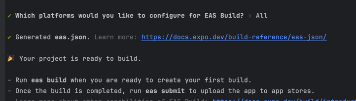
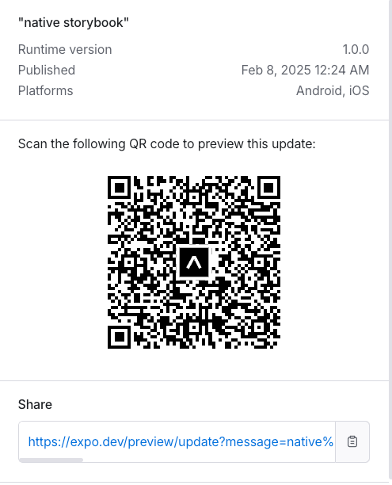

# React Native Storybook 프로젝트 셋업 가이드 😉
(공식문서 너무 불친절하당 ㅎㅎ)

## 주요 문제점과 해결 과정

### 초기 설정 문제가 딱 두가지였음
1. **모듈 해결 오류**
    - `expo/metro-config` 모듈을 찾지 못하는 문제 발생
    - 해결: `npm install expo` 패키지 설치

2. **Storybook 연결 복잡성**
    - `_layout.tsx`, `.storybook/storybook.requires.ts` 등 여러 설정 파일 조정 필요
    - 각 파일의 정확한 import와 export 설정이 중요

## 그리하여 ~~ 프로젝트 생성은 이렇게 합니당 ~

1. Expo 프로젝트 초기화
```bash
npx create-expo-app React-native-test
cd React-native-test
```

2. Storybook 설치
```bash
npx sb init --type react_native
```

## 주요 설정 파일

### app/_layout.tsx
```typescript
export { default } from '../.storybook';
```

### metro.config.js
```javascript
const { getDefaultConfig } = require('@expo/metro-config');
const config = getDefaultConfig(__dirname);
const withStorybook = require('@storybook/react-native/metro/withStorybook');
module.exports = withStorybook(config);
```

## 배포 방법

### Expo 로그인
```bash
npx expo login
```

### EAS 설정
```bash
npm install -g eas-cli
eas build:configure
eas update
```

## 주요 내용
- Expo로 배포함
- Expo Go를 통해 앱 공유 가능 = QR접속과 링크접속 둘다 가능함
- 링크 https://expo.dev/preview/update?message=native%20storybook&updateRuntimeVersion=1.0.0&createdAt=2025-02-07T15%3A24%3A36.886Z&slug=exp&projectId=2a54cb85-c37e-41aa-9c08-3348c3c5be1e&group=9dab9b22-4830-4ece-afda-f6ad628c3ebe
- EAS를 통해 팀 내부 배포 진행 가능
- 근데 이거 레포 따로 파야함 개발이랑 따로 진행해야함

# 🐟정말 기뻤던 순간 





